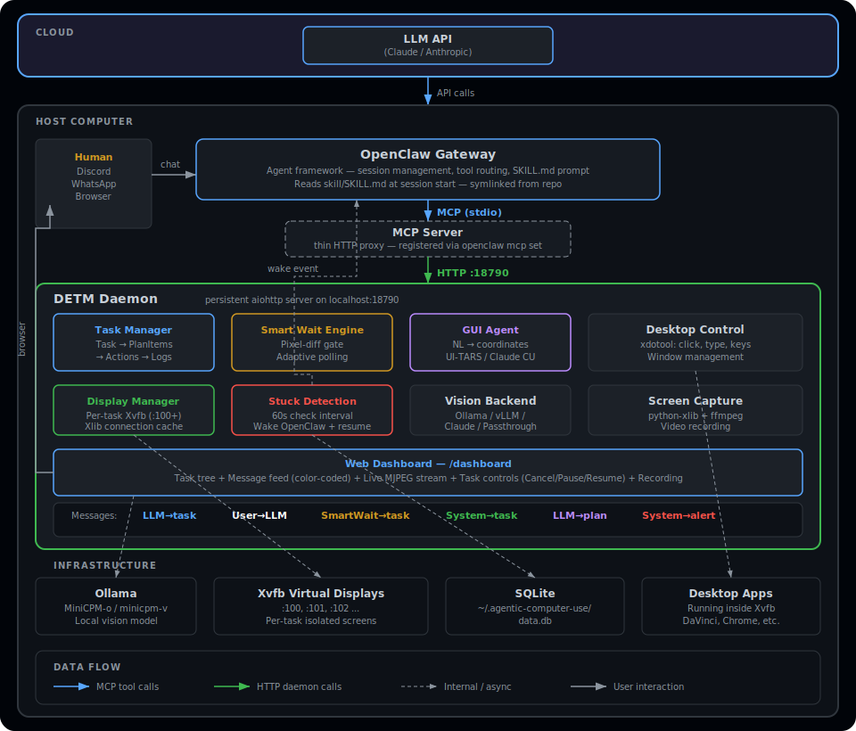

# agentic-computer-use

Desktop Environment Task Manager (DETM) — an MCP server with hierarchical task tracking, smart visual waiting, GUI automation with NL grounding, pluggable vision backends, shared or isolated virtual displays, and a live web dashboard. All local-first.

## Quick Install

```bash
git clone https://github.com/alxdofficial/openclaw-memoriesai.git
cd openclaw-memoriesai
./install.sh
```

The installer handles:
- Python venv + dependencies
- Ollama + vision model (only when `ACU_VISION_BACKEND` is unset or `ollama`; skipped for cloud backends)
- System packages (xdotool, ffmpeg, fluxbox, Xvfb, scrot)
- Display detection: uses real X display if present, otherwise sets up Xvfb + x11vnc + noVNC (systemd services)
- Systemd service for the DETM daemon (auto-start, auto-restart)
- OpenClaw mcporter config
- MEMORY.md injection with idempotency markers (safe to re-run)

## Architecture



Five layers:
1. **Task Management** — hierarchical: Task → Plan Items → Actions → Logs
2. **Smart Wait** — vision-based async monitoring with pixel-diff gate + adaptive polling
3. **GUI Agent** — NL-to-coordinates grounding (UI-TARS, Claude CU, or direct xdotool)
4. **Vision** — pluggable backends (Ollama, vLLM, Claude, passthrough)
5. **Display Manager** — shared system display (VNC, `:99`) by default; opt-in Xvfb isolation per task

```
┌──────────────────────┐   HTTP proxy   ┌──────────────────────────────┐
│  MCP Server (proxy)  │──────────────▶│  DETM daemon (:18790)        │
│  (spawned per-call   │               │  ├── Task Manager (hierarchy) │
│   by mcporter)       │               │  ├── Wait Engine (async)      │
└──────────────────────┘               │  ├── GUI Agent (NL grounding) │
                                       │  ├── Desktop Control (xdotool)│
                                       │  ├── Display Manager          │
                                       │  ├── Frame Buffer (~4fps)     │
                                       │  ├── Stuck Detection (opt-in) │
                                       │  ├── Web Dashboard            │
                                       │  └── Vision (pluggable)       │
                                       └──────────────────────────────┘
```

## Tools (24)

### Task Management (Hierarchical)
| Tool | Description |
|------|-------------|
| `task_register` | Create task with plan items. Shares system display by default; `metadata={"isolated_display": true}` for private Xvfb. |
| `task_update` | Post message (narration), change status, query state |
| `task_item_update` | Update plan item status (pending/active/completed/failed/skipped/**scrapped**). Scrapped items appear struck-through and collapsed in the dashboard. |
| `task_plan_append` | Append new plan items to an existing task. Use after scrapping to add revised steps. |
| `task_log_action` | Log action under a plan item (cli/gui/wait/vision/reasoning) |
| `task_summary` | Item-level overview (default), actions, full, or focused (expand only active item) |
| `task_drill_down` | Expand one plan item to see actions + logs |
| `task_thread` | Legacy message thread view |
| `task_list` | List tasks by status (default: all) |

### Smart Wait
| Tool | Description |
|------|-------------|
| `smart_wait` | Delegate visual monitoring to local model |
| `wait_status` | Check active wait jobs |
| `wait_update` | Refine condition or extend timeout |
| `wait_cancel` | Cancel a wait job |

### GUI Agent
| Tool | Description |
|------|-------------|
| `gui_do` | Execute NL or coordinate action ("click the Export button") |
| `gui_find` | Locate element by description, return coords |

### Desktop Control
| Tool | Description |
|------|-------------|
| `desktop_action` | Raw xdotool: click, type, keys, windows |
| `desktop_look` | Returns screenshot image + text content with pixel dimensions. Served from pre-captured frame buffer (~0ms latency). No local vision model involved — you interpret the image directly. |
| `video_record` | Record screen/window clip |

### Live AI Delegation
| Tool | Description |
|------|-------------|
| `live_ui` | Delegate a multi-step UI workflow to an OpenRouter-hosted vision model. The model sees the current screen, emits one tool call at a time, and iteratively acts via xdotool until done or escalating. Requires `OPENROUTER_API_KEY`. |
| `mavi_understand` | Record a screen clip, upload to Memories.AI (MAVI), then answer a question about the video. Useful for reviewing what happened on screen. Requires `MAVI_API_KEY`. |

### System
| Tool | Description |
|------|-------------|
| `health_check` | Daemon + vision + system status |
| `memory_search/read/append` | Workspace memory files |

## Requirements

| Component | Minimum | Recommended |
|-----------|---------|-------------|
| Python | 3.11+ | 3.12+ |
| GPU | None (CPU works) | NVIDIA RTX 3060+ (8GB VRAM) |
| RAM | 8 GB | 16 GB |
| OS | Linux (X11) | Ubuntu 22.04+ |
| Display | Xvfb (headless) or physical | Real X display or install.sh-managed VNC |

## Manual Setup

```bash
# 1. Python
python3 -m venv .venv
.venv/bin/pip install -e .

# 2. Ollama + model
curl -fsSL https://ollama.com/install.sh | sh
ollama pull minicpm-v

# 3. System deps
sudo apt install xdotool ffmpeg fluxbox xvfb scrot

# 4. Start daemon
DISPLAY=:99 .venv/bin/python3 -m agentic_computer_use.daemon

# 5. Configure mcporter (see install.sh for JSON config)
```

## Daemon — Start / Stop / Restart

The DETM daemon is the long-running process that hosts the wait engine, task manager, GUI agent, display manager, frame buffer, stuck detection, and dashboard. Everything else (MCP server, CLI) talks to it over HTTP.

### dev.sh (development)

The recommended way to run the daemon during development:

```bash
./dev.sh               # Start (or restart) daemon in tmux with debug logging
./dev.sh stop          # Kill the tmux session
./dev.sh logs          # Tail the debug log in current terminal
./dev.sh status        # Health check + tmux session status
```

The daemon runs inside a tmux session called `detm-dev` so it persists after SSH disconnect. Attach to watch live output:

```bash
tmux attach -t detm-dev       # Watch live output
# Ctrl-B D to detach (daemon keeps running)
```

### Systemd (production)

```bash
sudo systemctl start detm-daemon        # Start
sudo systemctl stop detm-daemon         # Stop
sudo systemctl restart detm-daemon      # Restart
sudo systemctl status detm-daemon       # Check status
journalctl -u detm-daemon -f            # Follow logs
```

The systemd unit is installed by `./install.sh` and auto-starts on boot.

### Manual

```bash
# Start in foreground with debug logging
ACU_DEBUG=1 DISPLAY=:99 PYTHONPATH=src .venv/bin/python3 -m agentic_computer_use.daemon
```

### Health check

```bash
curl http://127.0.0.1:18790/health      # JSON status of daemon + vision + GPU
```

## Dashboard

The dashboard is a built-in web UI served by the daemon — no separate process needed. It starts and stops with the daemon.

### Access

```
http://127.0.0.1:18790/dashboard
```

**Local access** — open in a browser on the same machine, or via noVNC.

**Remote access** — the daemon only listens on localhost. To access from another machine (e.g. your Mac over Tailscale), use an SSH tunnel:

```bash
# On your Mac:
ssh -L 18790:127.0.0.1:18790 alex@<tailscale-ip>

# Then open in browser:
open http://localhost:18790/dashboard
```

### Dashboard features

- **Task list sidebar** — all tasks with status badges and progress bars; task delete button
- **Task tree** — expandable plan items with nested actions
  - Task control buttons: **Pause**, **Resume**, **Cancel** in the tree header
  - Scrapped plan items appear collapsed, grayed out with strikethrough
- **Action tags** — each action shows a sender/subsystem label:
  - `gui:click`, `gui:type`, etc. — GUI actions with sub-action detail
  - `vision:look` — desktop_look / screenshot actions
  - `wait:active`, `wait:resolved`, `wait:timeout` — smart wait lifecycle
  - `cli:exec` — shell commands
  - `llm:reasoning` — LLM narration / reasoning steps
- **Action details** — click any action to expand; GUI/wait actions show:
  - Before/after screenshot thumbnails (click to open full-res lightbox)
  - Click coordinates and confidence scores (GUI actions)
  - Wait verdict reasoning, elapsed time, target (wait actions)
- **Message feed** — color-coded message stream below the task tree:
  - Blue: LLM narration (`LLM -> task`)
  - White: User messages (`User -> LLM`)
  - Yellow: Smart wait events (`SmartWait -> task`)
  - Gray: Lifecycle events (`System -> task`)
  - Green: Progress updates (`System -> task`)
  - Purple: Plan changes (`LLM -> plan`)
  - Red: Stuck alerts (`System -> alert`)
- **Live screen viewer** — always shows the live system display (`:99`) even when no task is selected. Polled JPEG snapshots at 500ms (replaces the previous MJPEG stream).
- **Replay mode** — scrub through auto-recorded frames for any task; scrubber syncs to audio playback position
- **Recording controls** — start/stop manual screen recording per task
- **Live session monitor** — when `live_ui` is running, a pulsing "● Live" button appears on the task card. Click to open a live modal with real-time SSE event feed, auto-updating frame display, and streaming PCM audio via Web Audio API
- **AI API usage stats** — cost tracking panel at the bottom of the dashboard: total cost, requests, input/output tokens; per-model breakdown table with proportional cost bars; daily cost bar chart; time filter (today / 7d / 30d / all time)
- **Poll intervals** — task list: 1s; selected task detail: 500ms; live sessions: 2s; usage stats: 30s

### Dashboard API endpoints

| Endpoint | Method | Description |
|----------|--------|-------------|
| `/dashboard` | GET | Dashboard HTML page |
| `/api/tasks` | GET | List tasks (`?status=active&limit=20`) |
| `/api/tasks/{id}` | GET | Task detail (`?detail=items\|actions\|full\|focused`) |
| `/api/tasks/{id}` | DELETE | Delete a task |
| `/api/tasks/{id}/messages` | GET | Task message feed (`?limit=50`) |
| `/api/tasks/{id}/status` | POST | Change task status (`{"status":"cancelled"}`) |
| `/api/tasks/{id}/items/{ord}` | GET | Drill into plan item |
| `/api/tasks/{id}/snapshot` | GET | Single JPEG snapshot for task's display (from frame buffer) |
| `/api/tasks/{id}/frames` | GET | List recorded frame indices |
| `/api/tasks/{id}/frames/{n}` | GET | Fetch a single recorded frame |
| `/api/tasks/{id}/screen` | GET | MJPEG stream for task's display (legacy) |
| `/api/tasks/{id}/record/start` | POST | Start screen recording |
| `/api/tasks/{id}/record/stop` | POST | Stop screen recording |
| `/api/tasks/{id}/record/status` | GET | Recording status |
| `/api/snapshot` | GET | Single JPEG snapshot of full system display (from frame buffer) |
| `/api/screen` | GET | MJPEG stream of full desktop (legacy) |
| `/api/screenshots/{filename}` | GET | Serve action screenshot files |
| `/api/recordings/{filename}` | GET | Serve recording files |
| `/api/waits` | GET | Active wait jobs |
| `/api/health` | GET | Health check |
| `/api/usage/stats` | GET | AI API usage stats (`?since=1\|7\|30` days or empty for all time) |
| `/api/live_sessions/active` | GET | Map of `task_id → session_id` for running `live_ui` sessions |
| `/api/live_sessions/{id}` | GET | Session events list |
| `/api/live_sessions/{id}/events/stream` | GET | SSE stream of new events (tails `events.jsonl`) |
| `/api/live_sessions/{id}/frames/{n}` | GET | JPEG frame from live session |
| `/api/live_sessions/{id}/audio` | GET | Session audio as WAV (live or complete) |
| `/api/live_sessions/{id}/audio/stream` | GET | Chunked raw PCM stream (24kHz mono Int16-LE) |

### Screenshots

Action screenshots (GUI before/after, wait before/after) are saved to:

```
~/.agentic-computer-use/screenshots/
```

Files are named `{action_id}_{role}.jpg` and `{action_id}_{role}_thumb.jpg`. The dashboard fetches thumbnails via `/api/screenshots/` and opens full-res in a lightbox on click.

## Display Architecture

Tasks default to the **shared system display** (`:99` by default). All tasks on the same machine see and control the same screen. This is intentional for single-agent workflows — no display allocation overhead, and the live dashboard view always reflects the real desktop.

**Opt-in isolation** — if a task needs its own private Xvfb, pass `metadata={"isolated_display": true}` to `task_register`:

```bash
# Via MCP tool:
task_register(name="Edit video", plan=[...], metadata={"isolated_display": true})

# Override resolution (default 1280x720):
task_register(name="Edit video", plan=[...], metadata={"isolated_display": true, "display_width": 1920, "display_height": 1080})

# The task's display is stored in metadata as "display" (e.g., ":100")
# All tools that accept task_id automatically target the correct display
```

Isolated displays are released automatically when a task reaches a terminal status (completed, failed, cancelled).

### Headless server setup

On headless servers (no real X display), `install.sh` automatically sets up:

| Service | Description |
|---------|-------------|
| `detm-xvfb` | Xvfb virtual framebuffer on `:99` at 1920×1080 |
| `detm-vnc` | x11vnc serving the virtual display on localhost:5901 |
| `detm-novnc` | noVNC websockify proxy on localhost:6080 |

After install on a headless server:
```
http://127.0.0.1:6080/vnc.html   # browser VNC client
```

On a machine with a real display, VNC services are not installed.

## Frame Buffer

The daemon maintains a background frame buffer per display, refreshed at ~4fps using `run_in_executor` (non-blocking). Both `desktop_look` and the dashboard snapshot endpoints read from this buffer — no blocking Xlib round-trip on each call.

`desktop_look` returns two content items:
1. An `ImageContent` with the JPEG screenshot
2. A `TextContent` with the pixel dimensions: `Display: WIDTHxHEIGHTpx. Coordinates in your next click/action must use these pixel dimensions exactly.`

## Stuck Detection

Stuck detection is **off by default**. Enable it by setting:

```bash
ACU_STUCK_DETECTION=1
```

When enabled, the daemon monitors active tasks for inactivity and posts a stuck alert to the task's message feed after `STUCK_THRESHOLD_SECONDS` (default: 300s) with no progress. Alerts fire at most once per `STUCK_ALERT_COOLDOWN_SECONDS` (default: 300s).

## LLM Guidance (SKILL.md)

The file `skill/SKILL.md` is the prompt that teaches OpenClaw's LLM how to use DETM tools. It covers:
- Tool reference and lifecycle patterns
- When to use GUI vs CLI
- Shared vs isolated display usage
- Scrapping plan items and appending revised steps
- Narration requirements (writing reasoning to task history)
- Dashboard awareness (the human can cancel tasks)
- Stuck detection behavior

When updating tools or behavior, keep SKILL.md in sync — it's what the LLM actually reads.

## Configuration

| Variable | Default | Description |
|----------|---------|-------------|
| `DISPLAY` | `:99` | X11 display used for the shared system display |
| `ACU_VISION_BACKEND` | `ollama` | ollama, vllm, claude, passthrough |
| `ACU_VISION_MODEL` | `minicpm-v` | Ollama model name |
| `ACU_VLLM_URL` | `http://localhost:8000` | vLLM API endpoint |
| `ACU_VLLM_MODEL` | `ui-tars-1.5-7b` | vLLM model name |
| `ACU_CLAUDE_VISION_MODEL` | `claude-sonnet-4-20250514` | Claude vision model |
| `ACU_GUI_AGENT_BACKEND` | `direct` | direct, uitars, claude_cu |
| `OPENROUTER_API_KEY` | -- | OpenRouter API key — enables cloud UI-TARS grounding |
| `ACU_UITARS_OLLAMA_MODEL` | `0000/ui-tars-1.5-7b` | Ollama model for local UI-TARS grounding |
| `ACU_UITARS_KEEP_ALIVE` | `5m` | Ollama keep_alive for UI-TARS (frees VRAM after idle) |
| `ACU_DEBUG` | `0` | Enable verbose debug logging |
| `ACU_WORKSPACE` | `~/.openclaw/workspace` | Workspace directory for memory files |
| `ACU_STUCK_DETECTION` | `0` | Enable stuck detection (`1` to turn on) |
| `ACU_DESKTOP_LOOK_DIM` | `1200` | Max pixel dimension for desktop_look images |
| `ACU_DESKTOP_LOOK_QUALITY` | `72` | JPEG quality for desktop_look images |
| `OLLAMA_HOST` | `http://localhost:11434` | Ollama API endpoint |
| `ANTHROPIC_API_KEY` | -- | Required for Claude vision/GUI backends |
| `ACU_OPENROUTER_LIVE_MODEL` | `google/gemini-3-flash-preview` | OpenRouter model used by `live_ui` |
| `MAVI_API_KEY` | -- | Memories.AI API key — required for `mavi_understand` |

## Repository Layout

```
src/agentic_computer_use/
├── capture/              # screen capture, frame recording, pixel diff
│   ├── screen.py         #   X11 screen capture via python-xlib
│   ├── frame_recorder.py #   auto frame recording (run_in_executor, non-blocking)
│   └── diff.py           #   pixel-diff gate for smart wait
├── dashboard/            # web dashboard UI (HTML/JS/CSS)
│   ├── index.html
│   ├── style.css
│   ├── app.js
│   └── components/       #   task-list, task-tree, screen-viewer, message-feed,
│                         #   live-session-viewer, usage-stats
├── desktop/              # low-level xdotool wrappers (mouse, keyboard, windows)
├── display/              # Xvfb display allocation & management
├── gui_agent/            # single-action GUI agent (omniparser, uitars, claude_cu backends)
├── live_ui/              # multi-turn VLM UI automation (OpenRouter provider)
│   ├── openrouter.py     #   screenshot → tool call → observe loop
│   ├── actions.py        #   xdotool action execution with smooth mouse animation
│   ├── session.py        #   event log, frame saving, PCM audio recording
│   └── base.py           #   abstract LiveUIProvider base class
├── task/                 # task lifecycle management
├── video/                # video recording (ffmpeg)
├── wait/                 # smart wait engine + adaptive polling
├── wait_vision/          # vision backends for smart_wait condition evaluation
│                         #   (ollama, vllm, claude, openrouter, passthrough)
├── config.py             # configuration from env vars
├── daemon.py             # persistent HTTP daemon (aiohttp)
├── db.py                 # SQLite schema + helpers
├── debug.py              # colored debug logging
├── mavi.py               # MAVI video intelligence integration
├── screenshots.py        # action screenshot storage
├── server.py             # MCP tool server (thin HTTP proxy to daemon)
└── usage.py              # AI API cost tracking

skill/
  SKILL.md                # LLM prompt — teaches OpenClaw how to use DETM

scripts/
  acu_scenario_live_ui.py # test harness for live_ui fixture testing
  acu_harness.py          # shared test harness utilities
  fixtures/               # HTML test fixtures (form, clock, wait)

docs/
  ARCHITECTURE.md         # detailed architecture with ASCII diagrams
  TOOLS.md                # complete tool parameter reference
  LOCAL-TESTING.md        # guide for running test scenarios

tests/
  test_integration.py     # integration tests (verdict parser, diff gate, task lifecycle)
```

## Logs & Debugging

```bash
./dev.sh logs                           # Live colored debug tail
tail -f ~/.agentic-computer-use/logs/debug.log
ACU_DEBUG=1 detm-daemon                 # Start with debug logging
```

## Storage

| Path | Contents |
|------|----------|
| `~/.agentic-computer-use/data.db` | SQLite database (tasks, plan_items, actions, action_logs, task_messages, wait_jobs, usage_events) |
| `~/.agentic-computer-use/screenshots/` | Action screenshots (before/after for GUI and wait actions) |
| `~/.agentic-computer-use/recordings/` | Screen recordings |
| `~/.agentic-computer-use/live_sessions/{id}/` | Live session data: `events.jsonl`, `frames/`, `audio.pcm`, `audio.wav` |
| `~/.agentic-computer-use/logs/debug.log` | Debug log (when ACU_DEBUG=1) |

## Tests

```bash
.venv/bin/python -m pytest tests/ -v
```

9 integration tests covering: structured verdict parser, pixel-diff gate, adaptive poller, job context prompt, task lifecycle, status normalization, hierarchical task model, stuck detection with resume packets.

## License

MIT
